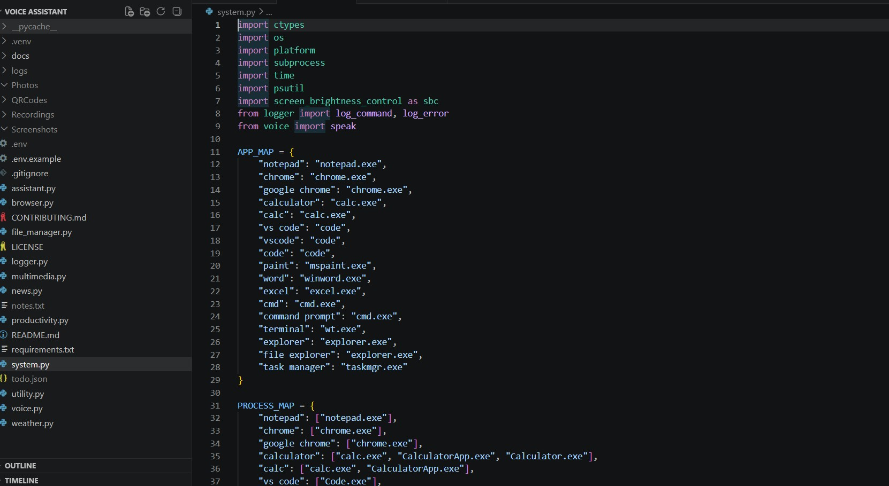
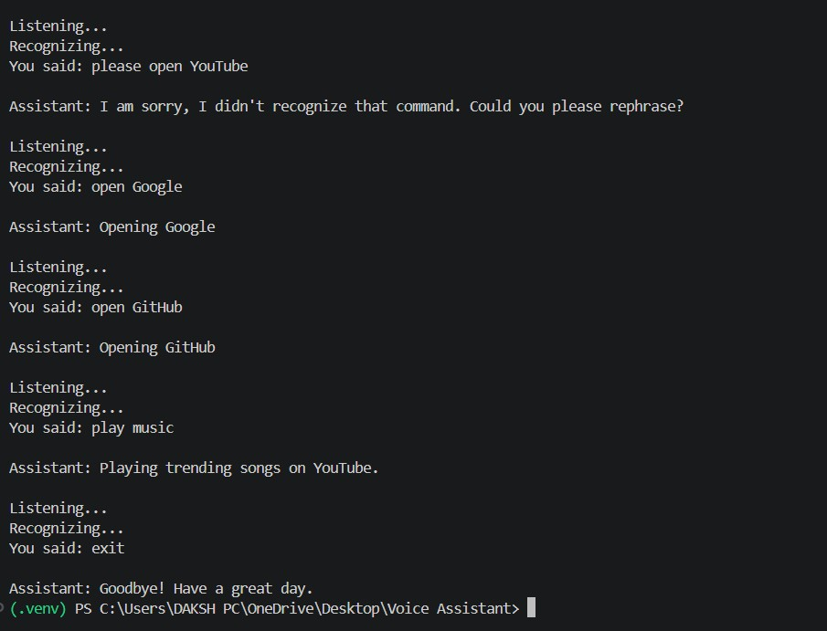
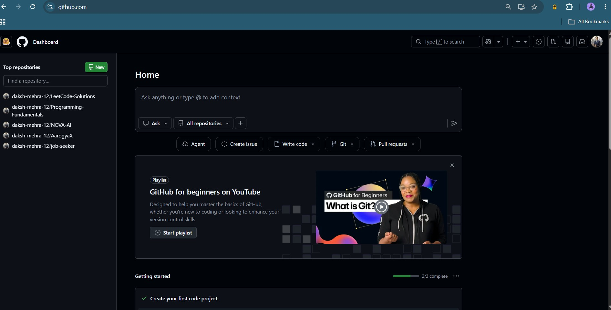
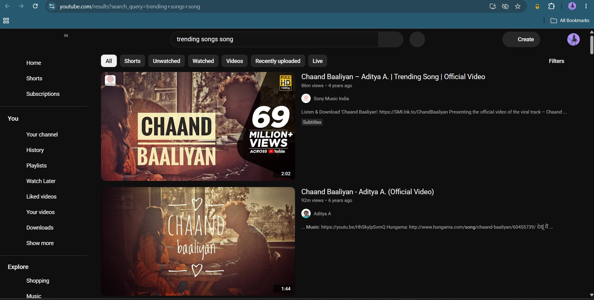

# 🎙️ NOVA AI - Advanced Modular Desktop Voice Assistant

[](https://www.python.org/downloads/)
[](https://opensource.org/licenses/MIT)
[](https://www.microsoft.com/windows)
[](https://www.python.org/dev/peps/pep-0008/)
[](https://github.com/your-username/nova-ai-voice-assistant)

**NOVA AI** (Next-generation Operations & Voice Assistant) is an open-source, modular, asynchronous desktop voice assistant built in Python. Designed with a clean single-responsibility architecture, NOVA AI automates operating system tasks, file management, productivity workflows, media capture, web searches, and real-time information retrieval using voice commands.

---

## 🌟 Key Features

- 🗣️ **Speech Recognition & Multi-Engine TTS**: High-accuracy Google Speech API integration with fallbacks to CLI input, powered by pyttsx3 and SAPI5.
- ⚙️ **Native System Control**: Volume adjustments, brightness control, battery status, CPU/RAM monitoring, disk space analytics, lock workstation, sleep, hibernation, and recycle bin management.
- 📁 **Smart File & Directory Management**: Quick access to special user folders (Desktop, Downloads, Documents), recursive file search, folder creation, file renaming, file deletion (with confirmation), and screenshot capture.
- 📷 **Camera & Multimedia Automation**: Capture photos via OpenCV, record WAV audio clips via sounddevice, play local videos, launch Windows camera, and control media play/pause state.
- ⏱️ **Productivity & Task Tools**: JSON-backed todo list management, persistent note-taking, background Pomodoro focus timers (`threading.Timer`), and customizable reminders.
- 🌐 **Information & API Integrations**: OpenWeatherMap integration (with `wttr.in` fallback), top news headlines via NewsData/NewsAPI (with Google News RSS fallback), Wikipedia queries, and daily quotes/facts.
- 🛠️ **Utility Tools**: Clipboard read/write, PNG QR code generator, cryptographically safe password generator, real-time currency converter, unit conversions, and inline math calculator.
- 📋 **Audit & Logging System**: Centralized logging system recording system events and user command histories.

---

## 🏗️ System Architecture

```
                                  +-----------------------+
                                  |    User Audio Input   |
                                  +-----------+-----------+
                                              |
                                              v
                                  +-----------------------+
                                  |    voice.py (STT)     |
                                  |  (Google Speech API / |
                                  |   Microphone Fallback)|
                                  +-----------+-----------+
                                              |
                                              v
                                  +-----------------------+
                                  |   assistant.py (Core) |
                                  | (Command Dispatcher & |
                                  |   Pattern Matching)   |
                                  +-----------+-----------+
                                              |
       +------------------+-------------------+-------------------+------------------+
       |                  |                   |                   |                  |
       v                  v                   v                   v                  v
+--------------+   +--------------+    +--------------+    +--------------+   +--------------+
|  system.py   |   | file_manager |    | multimedia.py|    |productivity.py|   | utility.py   |
| (OS/App/Sys) |   | (Files/Scrn) |    | (Cam/Audio)  |    | (Notes/Todos)|   | (QR/Math/Pass|
+--------------+   +--------------+    +--------------+    +--------------+   +--------------+
       |                  |                   |                   |                  |
       +------------------+-------------------+-------------------+------------------+
                                              |
                                              v
                                  +-----------------------+
                                  |     voice.py (TTS)    |
                                  | (pyttsx3 / SAPI5 /    |
                                  |   win32com Fallback)  |
                                  +-----------+-----------+
                                              |
                                              v
                                  +-----------------------+
                                  |       logger.py       |
                                  | (File Logging & Audit)|
                                  +-----------------------+
```

---

## 📂 Project Directory Structure

```
nova-ai-voice-assistant/
├── assets/
│   └── screenshots/            # Visual presentation screenshots for GitHub
├── docs/                       # Technical architecture & module documentation
│   ├── PROJECT_OVERVIEW.md     # In-depth architectural design document
│   ├── ARCHITECTURE.md         # Detailed sequence flows & control logic
│   └── MODULES.md              # Functional specifications for each module
├── logs/                       # System & command logs (Git ignored)
├── Photos/                     # Webcam captures directory (Git ignored)
├── QRCodes/                    # Generated PNG QR codes (Git ignored)
├── Recordings/                 # Captured audio WAV files (Git ignored)
├── Screenshots/                # User desktop screenshots (Git ignored)
├── assistant.py                # Main application entry point & query router
├── browser.py                  # Web browser automation module
├── file_manager.py             # File search & system directory operations
├── logger.py                   # Centralized logging & command auditing
├── multimedia.py               # Camera, webcam capture & audio recording
├── news.py                     # News headlines aggregator with RSS fallback
├── productivity.py             # Todo list, notes, Pomodoro & reminders
├── system.py                   # OS hardware metrics, power & app control
├── utility.py                  # Clipboard, QR code, math, currency & password tools
├── voice.py                    # Speech-To-Text & Text-To-Speech engine
├── weather.py                  # OpenWeatherMap & wttr.in weather provider
├── .env.example                # Sample environment variable template
├── .gitignore                  # Standard Python & OS ignore rules
├── CONTRIBUTING.md             # Open source contribution guidelines
├── LICENSE                     # MIT Open Source License
└── requirements.txt            # Project Python dependencies
```

---

## 💻 Requirements

- **Operating System**: Windows 10 / 11 (Recommended for native win32 API hooks)
- **Python**: Python 3.8 or higher
- **Hardware**: Working microphone and speakers / headphones. Webcam required for photo capture.

---

## ⚙️ Environment Variables

Create a `.env` file in the project root directory based on `.env.example`:

```env
# OpenWeatherMap API Key (https://openweathermap.org/api)
OPENWEATHER_API_KEY=YOUR_OPENWEATHER_API_KEY

# News Data API Key (https://newsdata.io or https://newsapi.org)
NEWS_API_KEY=YOUR_NEWS_API_KEY

# Email Credentials for SMTP Email Sending
EMAIL_USER=YOUR_EMAIL@gmail.com
EMAIL_PASSWORD=YOUR_APP_PASSWORD
```

---

## 🚀 Quick Start & Installation

```bash
# 1. Clone the Repository
git clone https://github.com/daksh-mehra-12/Voice-Assistant.git
cd nova-ai-voice-assistant

# 2. Create and Activate Virtual Environment
python -m venv .venv
.venv\Scripts\activate

# 3. Install Dependencies
pip install -r requirements.txt

# 4. Set Up Environment Variables
copy .env.example .env
# Edit .env with your favorite editor and set your API keys

# 5. Launch NOVA AI
python assistant.py
```

---

## 🗣️ Supported Commands

| Category | Voice Command Examples |
| :--- | :--- |
| **System Control** | `"system info"`, `"battery status"`, `"cpu usage"`, `"disk usage"`, `"lock pc"`, `"sleep pc"`, `"volume up/down"` |
| **App Launcher** | `"open notepad"`, `"open chrome"`, `"open vs code"`, `"close chrome"`, `"empty recycle bin"` |
| **File Management**| `"open downloads"`, `"search file report.pdf"`, `"create folder Project"`, `"take screenshot"` |
| **Multimedia** | `"open camera"`, `"capture photo"`, `"record audio"`, `"play local video"`, `"pause music"` |
| **Browser Search** | `"search youtube Python tutorials"`, `"play music LoFi"`, `"search github voice assistant"` |
| **Productivity** | `"add todo Buy milk"`, `"read todo"`, `"take note Meeting at 4 PM"`, `"pomodoro"`, `"remind me"` |
| **Weather & News** | `"weather in London"`, `"get news"`, `"check internet"` |
| **Utilities** | `"generate password"`, `"generate qr code https://github.com"`, `"calculate 45 times 12"` |
| **Conversions** | `"convert 100 USD to EUR"`, `"convert 10 km to miles"`, `"convert 37 celsius to fahrenheit"` |
| **Knowledge** | `"wikipedia Artificial Intelligence"`, `"tell me a joke"`, `"daily quote"`, `"random fact"` |

---

## 🖼️ Screenshots

| Source Code | Voice Commands |
|--------------|----------------|
|  |  |

| GitHub Repository | YouTube Automation |
|-------------------|--------------------|
|  |  |
## 🗺️ Roadmap

- [x] **Phase 1: Core Voice Engine & Desktop Operations** (Completed)
  - Modular architecture, system control, productivity tools, media capture, fallbacks.
- [ ] **Phase 2: LLM & GUI Enhancement** (In Progress)
  - OpenAI ChatGPT / Claude LLM integration for conversational AI.
  - Persistent vector memory for contextual history.
  - Porcupine / Snowboy offline custom wake word ("Hey Nova").
  - PySide6 / CustomTkinter desktop GUI dashboard.
- [ ] **Phase 3: Multi-Modal Vision & Agents** (Planned)
  - OpenCV real-time vision analytics & object recognition.
  - Screen OCR and context understanding.
  - Autonomous multi-step AI Agent workflows.

---

## 🤝 Contributing

Contributions are welcome! Please review [CONTRIBUTING.md](CONTRIBUTING.md) for details on code style, branch strategies, and pull request workflows.

---

## 📄 License

Distributed under the MIT License. See [LICENSE](LICENSE) for more information.

---

## 👤 Author

- **Daksh Mehra** - Open Source Maintainer & Python Developer
- **GitHub**: daksh-mehra-12 https://github.com/daksh-mehra-12
- **LinkedIn**: Daksh Mehra https://www.linkedin.com/in/daksh-mehra/
